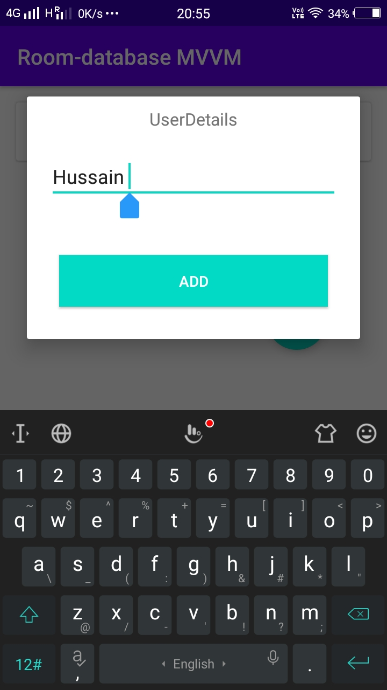
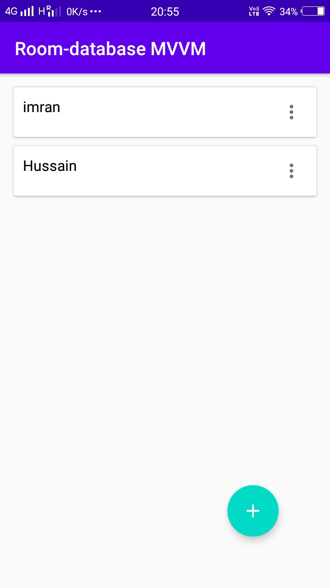
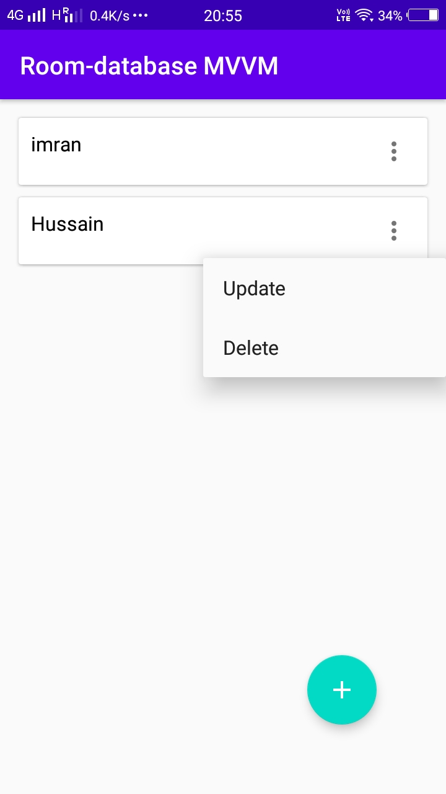

# Room-Livedata with-MVVM
This is a simple  application. It follows the MVVM design pattern using the Room with Live data. Users can simply create, Update,  and delete .

### Note: This application-focused is to follow the MVVM architecture using the Room persistent library. #Not focused on UI

  

